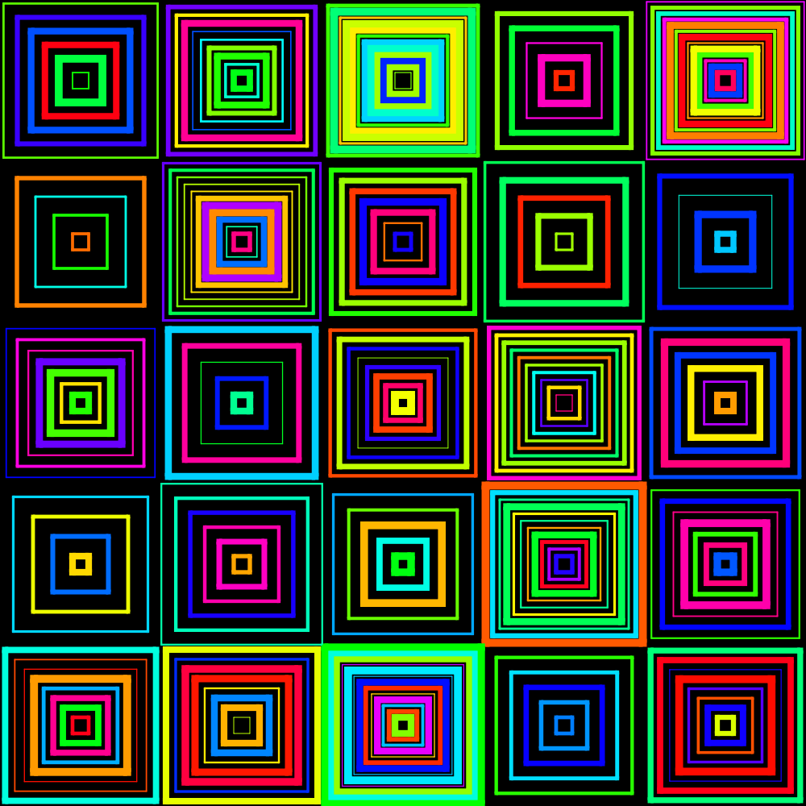

# desordres

desordres make visuals in the style of Des Ordres by Vera Molnár, using decksh markup.

For example: make a 1000x1000 pdf using default parameters:

```
desordres | decksh | pdfdeck -stdout -pagesize 1000x1000 - > gray.pdf
```


Make a 1000x1000 PNG file with random colors HSV(20-60, 100, 100), 14 tiles/row:

```
desordres -tiles 14 -color '20:60'  -bgcolor=black | decksh > f.xml
pngdeck -pagesize 1000x1000 f.xml
```


Use all hues:

```
desordres -tiles 5 -color '0:360' -bgcolor black | decksh | pdfdeck -stdout -pagesize 1000x1000 - > rainbow.pdf
```




Use a built-in color palette:

```
desordres -tiles 14 -color mist-gb > mist-gb.xml
pngdeck -pagesize 500x500 mist-gb.xml
```


## options
```
Usage of desordres:

Option      Default    Description
.....................................................
-tiles      10         number of tiles/row
-maxlw      1          maximim line thickness
-bgcolor    white      background color
-color      gray       color name, h1:h2, or palette:

                       links-awakening-sgb
                       blk-aqu4
                       funk-it-up
                       ice-cream-gb
                       rustic-gb
                       2-bit-grayscale
                       nintendo-super-gameboy
                       red-brick
                       arq4
                       pen-n-paper
                       ayy4
                       nintendo-gameboy-bgb
                       kankei4
                       ajstarks
                       kirokaze-gameboy
                       hollow
                       polished-gold
                       pokemon-sgb
                       blu-scribbles
                       autumn-decay
                       2-bit-demichrome
                       spacehaze
                       moonlight-gb
                       mist-gb
                       nostalgia
                       dark-mode

```

