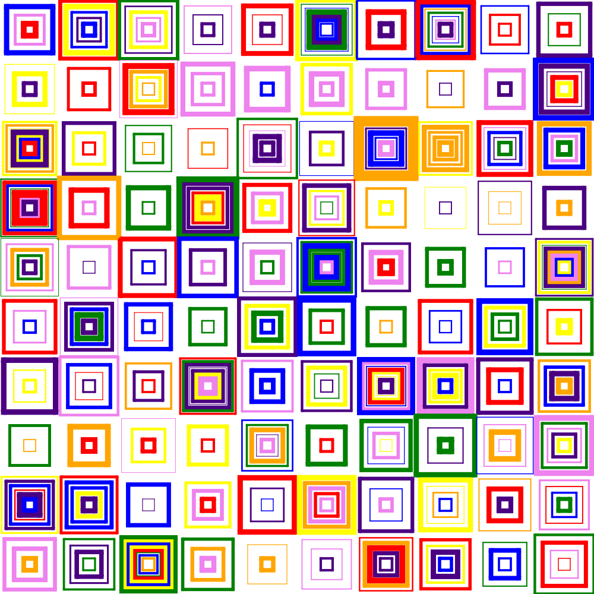

# desordres

desordres make visuals in the style of "Des Ordres" by Vera Molnár, using deck markup.

For example: make a 1000x1000 pdf using default parameters:

```
desordres | pdfdeck -stdout -pagesize 1000x1000 - > gray.pdf
```


Make a 1000x1000 PNG file with random colors HSV(20-60, 100, 100), 14 tiles/row:

```
desordres -tiles 14 -color '20:60'  -bgcolor=black > f.xml
pngdeck -pagesize 1000x1000 f.xml
```


Use all hues, make a PDF:

```
desordres -tiles 5 -color '0:360' -bgcolor black | pdfdeck -stdout -pagesize 1000x1000 - > rainbow.pdf
```


Use a built-in color palette:

```
desordres -tiles 14 -color mist-gb > mist-gb.xml
pngdeck -pagesize 500x500 mist-gb.xml
```


Load a custom palette:
```
desordres -p ajs.pal -color rainbow > rb.xml
pngdeck -pagesize 500x500 rb.xml
```




## options
```
Option      Default            Description
.....................................................
-tiles      10                 number of tiles/row
-maxlw      1                  maximim line thickness
-p          ""                 palette file
-bgcolor    white              background color
-color      gray               color name, h1:h2, or palette:

2-bit-demichrome               [#211e20 #555568 #a0a08b #e9efec]
nintendo-super-gameboy         [#331e50 #a63725 #d68e49 #f7e7c6]
blu-scribbles                  [#051833 #0a4f66 #0f998e #12cc7f]
2-bit-grayscale                [#000000 #676767 #b6b6b6 #ffffff]
hollow                         [#0f0f1b #565a75 #c6b7be #fafbf6]
ayy4                           [#00303b #ff7777 #ffce96 #f1f2da]
pokemon-sgb                    [#181010 #84739c #f7b58c #ffefff]
rustic-gb                      [#2c2137 #764462 #edb4a1 #a96868]
spacehaze                      [#f8e3c4 #cc3495 #6b1fb1 #0b0630]
moonlight-gb                   [#0f052d #203671 #36868f #5fc75d]
nintendo-gameboy-bgb           [#081820 #346856 #88c070 #e0f8d0]
pen-n-paper                    [#e4dbba #a4929a #4f3a54 #260d1c]
blk-aqu4                       [#002b59 #005f8c #00b9be #9ff4e5]
ajstarks                       [#aa0000 #aaaaaa #000000 #ffffff]
nostalgia                      [#d0d058 #a0a840 #708028 #405010]
links-awakening-sgb            [#5a3921 #6b8c42 #7bc67b #ffffb5]
arq4                           [#ffffff #6772a9 #3a3277 #000000]
kankei4                        [#ffffff #f42e1f #2f256b #060608]
dark-mode                      [#212121 #454545 #787878 #a8a5a5]
kirokaze-gameboy               [#332c50 #46878f #94e344 #e2f3e4]
mist-gb                        [#2d1b00 #1e606e #5ab9a8 #c4f0c2]
red-brick                      [#eff9d6 #ba5044 #7a1c4b #1b0326]
ice-cream-gb                   [#7c3f58 #eb6b6f #f9a875 #fff6d3]
autumn-decay                   [#313638 #574729 #975330 #c57938 #ffad3b #ffe596]
polished-gold                  [#000000 #361c1b #754232 #cd894a #e6b983 #fff8bc #ffffff #2d2433 #4f4254 #b092a7]
funk-it-up                     [#e4ffff #e63410 #a23737 #ffec40 #81913b #26f675 #4c714e #40ebda #394e4e #0a0a0a]

```

## palette files

```desordres``` has a built-in palette which may be overridden by specifying a palette file.

Custom palette files are of the form of name followed by a list of colors, one name per line.
Colors may be named colors or rgb triples in hex form (#rrggbb).

name color1 color2 ... colorn

for example:
```
ajstarks               #aa0000 #aaaaaa #000000 #ffffff
rainbow                red orange yellow green blue indigo violet
pen-n-paper            #e4dbba #a4929a #4f3a54 #260d1c
autumn-decay           #313638 #574729 #975330 #c57938 #ffad3b #ffe596
polished-gold          #000000 #361c1b #754232 #cd894a #e6b983 #fff8bc #ffffff #2d2433 #4f4254 #b092a7
funk-it-up             #e4ffff #e63410 #a23737 #ffec40 #81913b #26f675 #4c714e #40ebda #394e4e #0a0a0a
grayscale              #111111 #222222 #333333 #444444 #555555 #666666 #777777 #888888 #999999 #aaaaaa #bbbbbb #cccccc #dddddd #eeeeee
```


