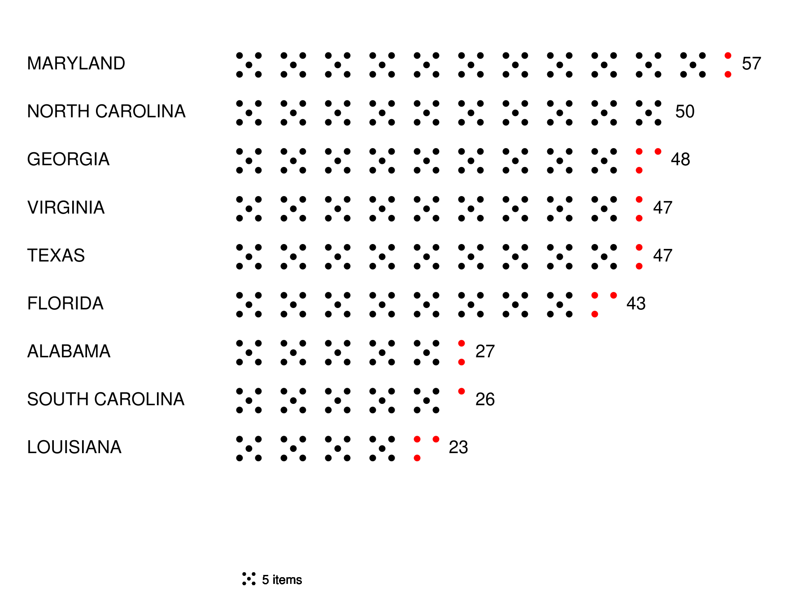

# dicechart



## Usage
dicechart [options] file.csv
where file.csv is "label",value
for example:

```
"MARYLAND",57
"NORTH CAROLINA",50
"GEORGIA",48
"VIRGINIA",47
"TEXAS",47
"FLORIDA",43
"ALABAMA",27
"SOUTH CAROLINA",26
"LOUISIANA",23
```

options are:
```

  -color string
    	dotcolor (default "black")
  -dotsize float
    	dot size (default 1)
  -ds float
    	dice spacing (default 5)
  -dw float
    	dice width (default 1.5)
  -dx float
    	data left position (default 35)
  -height float
    	canvas height (default 612)
  -lx float
    	label left position (default 10)
  -textsize float
    	canvas width (default 2)
  -title string
    	chart title
  -top float
    	top of the chart (default 85)
  -valsize float
    	canvas width (default 2)
  -vskip float
    	vertical skip (default 7)
  -width float
    	canvas width (default 792)
```
