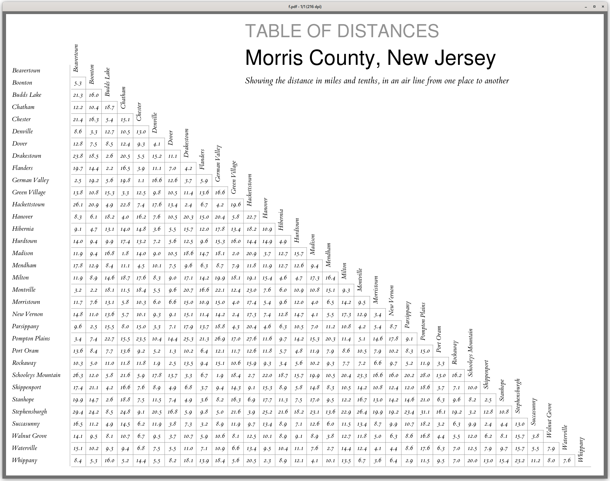

# distable: make a distance table



Derived from the design seen in the atlas of Morris county, New Jersey from 1868,
make a distance table using deck markup.  

distable takes as input a file with this format:

	Place1
	<tab>place2:distance
	<tab>place3:distance

For example:
```
Beavertown
Boonton
	Beavertown:5.30
Budds Lake
	Beavertown:21.30
	Boonton:16.00
Chatham
	Beavertown:12.20
	Boonton:10.40
	Budds Lake:18.70
Chester
	Beavertown:21.40
	Boonton:16.30
	Budds Lake:5.40
	Chatham:15.10
```

	$ go run distable.go < morris.d | pdfdeck -stdout - > morris.pdf

