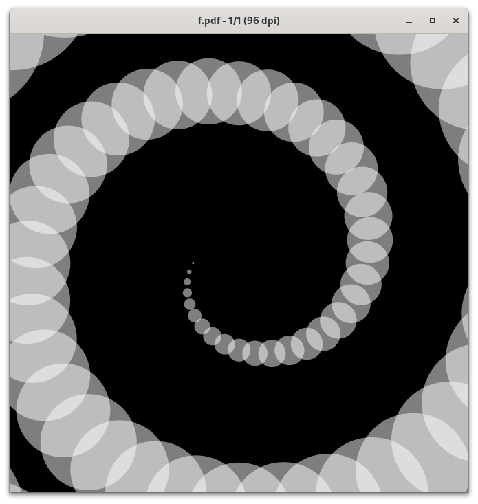

# dotspiral

Generate decksh code for a spiral where the size of the points increases



```
./dotspiral -end 1200 -bgcolor black -color white | decksh | pdfdeck -stdout -pagesize 500x500 - > f.pdf
```

### usage

```
  -bgcolor string
      background color (default "white")
  -color string
      dot color (default "red")
  -dincr float
      size increment (default 0.5)
  -end float
      end angle (default 360)
  -op float
      dot opacity (default 50)
  -r float
      radius (default 10)
  -rincr float
      radius increment (default 1)
  -size float
      dot size (default 0.5)
  -start float
      start angle (default 180)
  -tincr float
      angle increment (default 10)
```
