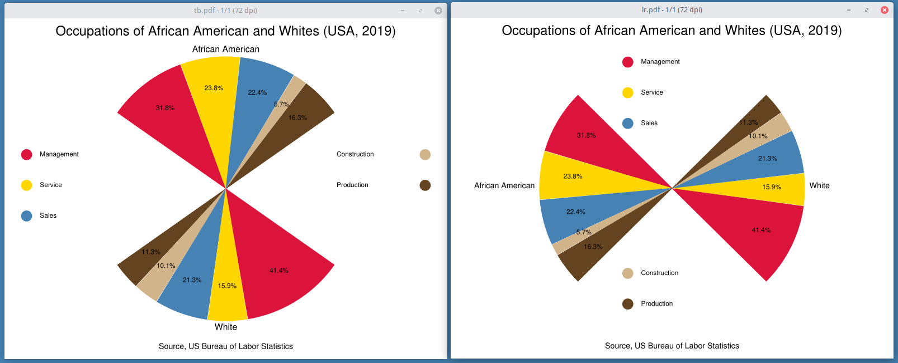
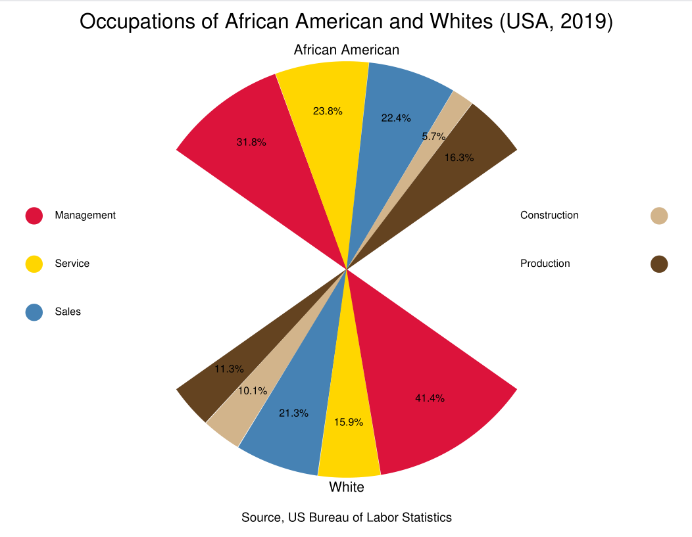
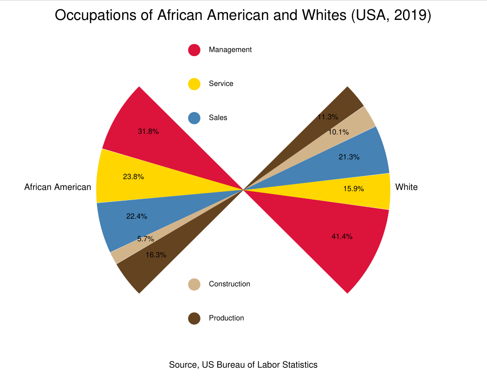

# fanchart -- make Du Bois style fan charts



Usage: fanchart [options] file..

Options:

	-h float
			canvas height (default 612)
	-dir string
			orientation (tb=Top/Bottom, lr=Left/Right) (default "tb")
	-size float
			fan/wing size (default 30)
	-w float
			canvas width (default 792)

Fanchart generates deck markup which can be rendered as PDF, SVG, or PNG


Data is a CSV file with this structure:

	column headers
	title,footnotes
	top/left section name
	item,value,color
	...
	bottom/right section name
	item,value,color

for example: given data.csv

	name,percent,color
	"Occupations of African American and Whites (USA, 2019)","Source, US Bureau of Labor Statistics",
	"African American",,
	Management,31.8,crimson
	Service,23.8,gold
	Sales,22.4,steelblue
	Construction,5.7,tan
	Production,16.3,"rgb(101,67,33)"
	White,,
	Management,41.4,crimson
	Service,15.9,gold
	Sales,21.3,steelblue
	Construction,10.1,tan
	Production,11.3,"rgb(101,67,33)"

```fanchart  data.csv | pdfdeck -stdout - > tbchart.pdf```  makes



```fanchart data.csv -orientation=lr | pdfdeck -stdout - > lrchart.pdf``` makes




