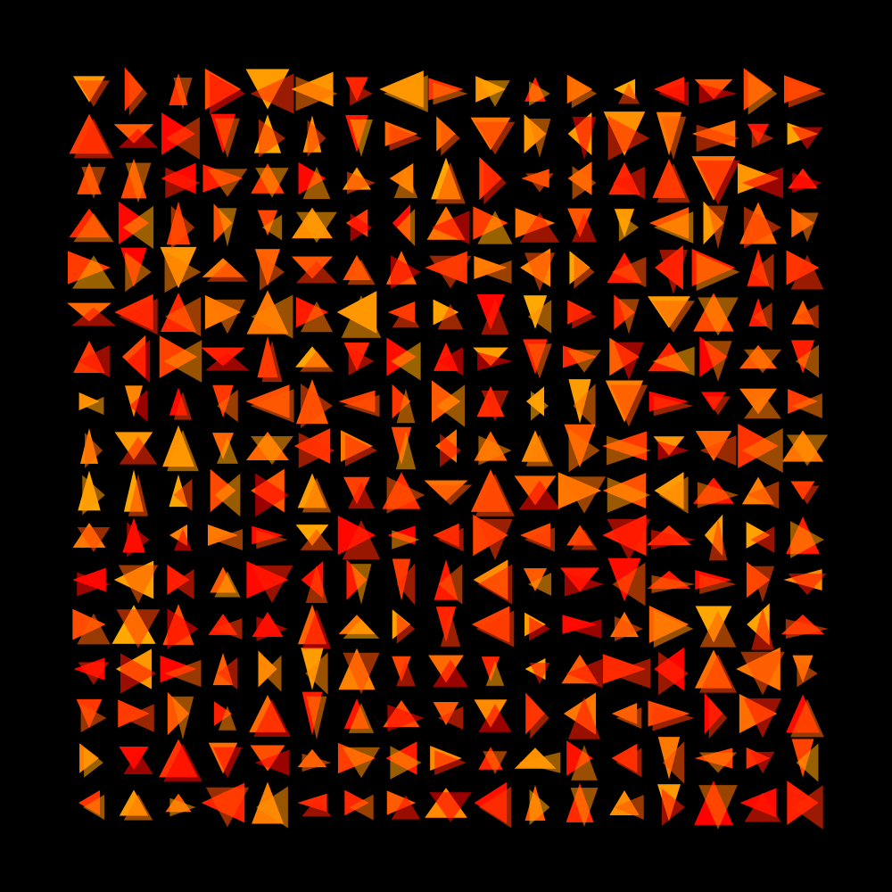
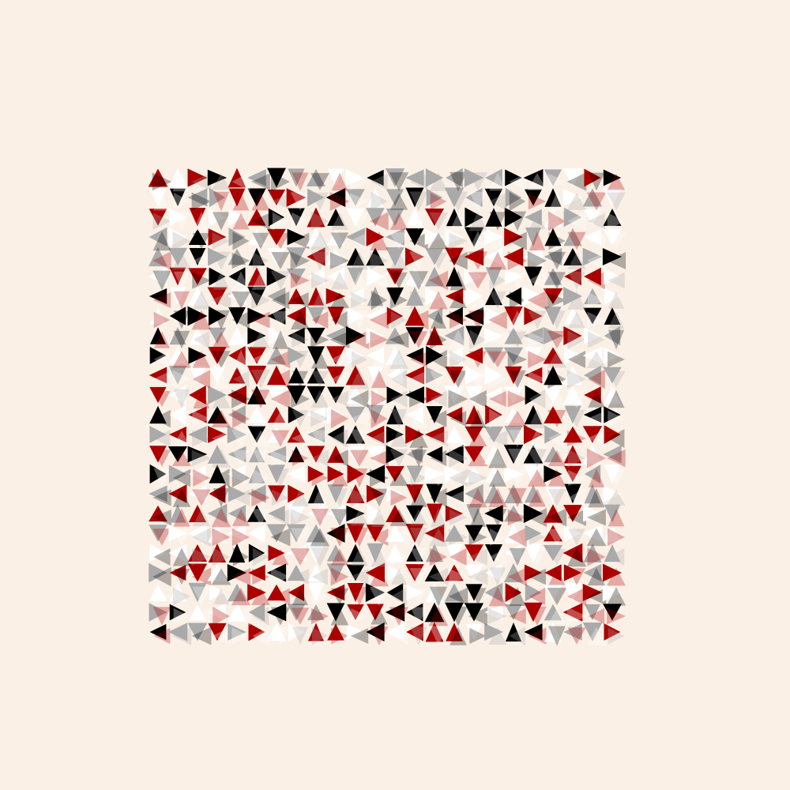
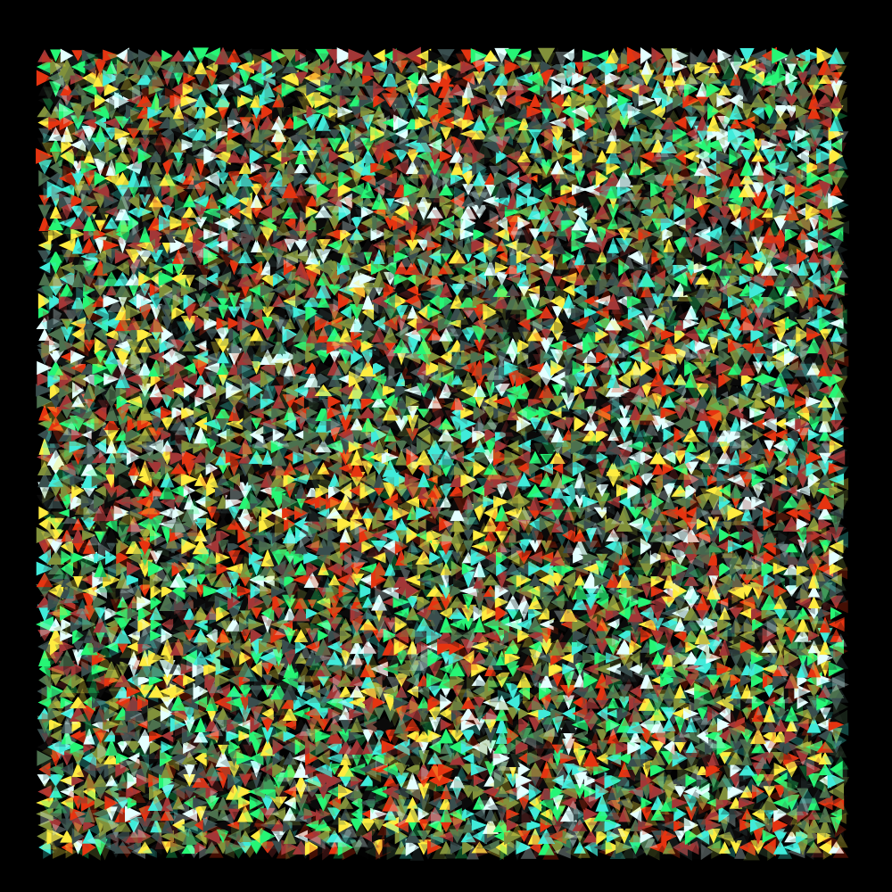

# fox -- inspired by "Fox I" by Anni Albers (using deck markup)



```fox -color 0:40 -shadow 60 -bgcolor black```



```fox -color ajstarks -w 20,80,2.5 -h 20,80,2.5  -shadow=30 -bgcolor linen```



```fox  -w 5,95,1.25 -h 5,95,1.25 -color funk-it-up  -shadow=30 -bgcolor black```

## options

```
Option      Default     Description
..................................................................
-help       false       show usage
-w          10,95,5     percent begin,end,step for the width
-h          10,95,5     percent begin,end,step for the height
-showdow    40          shadow opacity (0 for no shadow shape)
-bgcolor    white       background color
-color      gray        color name, hue range (h1:h2), or palette:

Palette Name            Colors
..........................................................
nintendo-gameboy-bgb	[#081820 #346856 #88c070 #e0f8d0]
arq4                	[#ffffff #6772a9 #3a3277 #000000]
blk-aqu4            	[#002b59 #005f8c #00b9be #9ff4e5]
kirokaze-gameboy    	[#332c50 #46878f #94e344 #e2f3e4]
rustic-gb           	[#2c2137 #764462 #edb4a1 #a96868]
dark-mode           	[#212121 #454545 #787878 #a8a5a5]
spacehaze           	[#f8e3c4 #cc3495 #6b1fb1 #0b0630]
blu-scribbles       	[#051833 #0a4f66 #0f998e #12cc7f]
nostalgia           	[#d0d058 #a0a840 #708028 #405010]
links-awakening-sgb 	[#5a3921 #6b8c42 #7bc67b #ffffb5]
red-brick           	[#eff9d6 #ba5044 #7a1c4b #1b0326]
nintendo-super-gameboy	[#331e50 #a63725 #d68e49 #f7e7c6]
ice-cream-gb        	[#7c3f58 #eb6b6f #f9a875 #fff6d3]
hollow              	[#0f0f1b #565a75 #c6b7be #fafbf6]
kankei4             	[#ffffff #f42e1f #2f256b #060608]
2-bit-grayscale     	[#000000 #676767 #b6b6b6 #ffffff]
pokemon-sgb         	[#181010 #84739c #f7b58c #ffefff]
pen-n-paper         	[#e4dbba #a4929a #4f3a54 #260d1c]
mist-gb             	[#2d1b00 #1e606e #5ab9a8 #c4f0c2]
ajstarks            	[#aa0000 #aaaaaa #000000 #ffffff]
moonlight-gb        	[#0f052d #203671 #36868f #5fc75d]
2-bit-demichrome    	[#211e20 #555568 #a0a08b #e9efec]
ayy4                	[#00303b #ff7777 #ffce96 #f1f2da]
autumn-decay        	[#313638 #574729 #975330 #c57938 #ffad3b #ffe596]
funk-it-up          	[#e4ffff #e63410 #a23737 #ffec40 #81913b #26f675 #4c714e #40ebda #394e4e #0a0a0a]
polished-gold       	[#000000 #361c1b #754232 #cd894a #e6b983 #fff8bc #ffffff #2d2433 #4f4254 #b092a7]
```