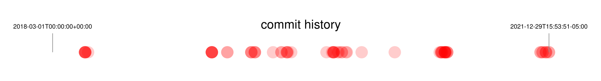

# Visualize git history


Reads git log output, formatted in ISO date format and shows the git history between two points in time.


	$ git log --date=iso | awk '/^Date:/ {print $2,$3,$4}' | gitdate -color red -begin 2018-03-01T00:00:00+00:00  | decksh | pdfdeck -stdout - > git.pdf

```
Usage of gitdate:
  -begin string
    	begin time (default "1970-01-01T00:00:00+00:00")
  -color string
    	color (default "black")
  -end string
    	end time (default "2021-12-29T15:48:36-05:00")
  -fulldeck
    	full deck markup (default true)
  -left float
    	left (default 10)
  -opacity float
    	opacity (default 20)
  -r float
    	radius (default 2)
  -right float
    	right (default 90)
  -title string
    	title (default "commit history")
  -y float
    	y point (default 50)
 ```