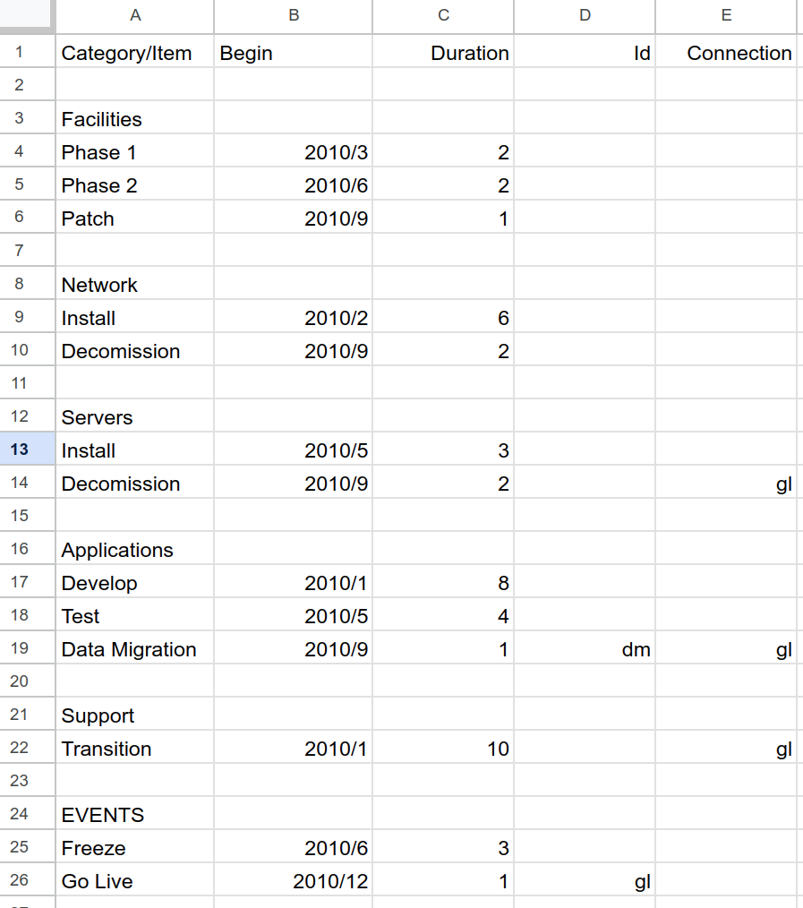

# rmcsv -- convert roadmap csv files to XML

Produces XML from CSV files named on the command line or standard input.
The convered XML goes to standard output.

```
rmcsv [options] file.csv... > file.xml
```

The CSV files have five fields: Category,begin,duration,id and connection.

The input:
```
"Category/Item",Begin,Duration,Id,Connection
,,,,
"Facilities",,,,
"Phase 1",2010/3,2,,
"Phase 2",2010/6,2,,
"Patch",2010/9,1,,
,,,,
"Network",,,,
"Install",2010/2,6,,
"Decomission",2010/9,2,,
,,,,
"Servers",,,,
"Install",2010/5,3,,
"Decomission",2010/9,2,,gl
,,,,
"Applications",,,,
"Develop",2010/1,8,,
"Test",2010/5,4,,
"Data Migration",2010/9,1,dm,gl
,,,,
"Support",,,,
"Transition",2010/1,10,,gl
,,,,
"EVENTS",,,,
"Freeze",2010/6,3,,
"Go Live",2010/12,1,gl,


```


Produces:

```
<roadmap title="Title" font="Calibri,sans-serif" shape="r" begin="2022" end="2023" catpercent="12" scale="12" itemheight="30" vspace="35">
	<category color="#000000" shape="r" itemheight="30" vspace="0">
		<item begin="2022/01" duration="12" bline="on">2022</item>
	</category>
	<category color="#bbbbbb" shape="r" itemheight="30" vspace="0">
		<item begin="2022/01" duration="1">Jan</item>
		<item begin="2022/02" duration="1">Feb</item>
		<item begin="2022/03" duration="1">Mar</item>
		<item begin="2022/04" duration="1">Apr</item>
		<item begin="2022/05" duration="1">May</item>
		<item begin="2022/06" duration="1">Jun</item>
		<item begin="2022/07" duration="1">Jul</item>
		<item begin="2022/08" duration="1">Aug</item>
		<item begin="2022/09" duration="1">Sep</item>
		<item begin="2022/10" duration="1">Oct</item>
		<item begin="2022/11" duration="1">Nov</item>
		<item begin="2022/12" duration="1">Dec</item>
	</category>
	<category name="Facilities" itemheight="30" vspace="35">
		<item begin="2010/3" duration="2">Phase 1</item>
		<item begin="2010/6" duration="2">Phase 2</item>
		<item begin="2010/9" duration="1">Patch</item>
	</category>
	<category name="Network" itemheight="30" vspace="35">
		<item begin="2010/2" duration="6">Install</item>
		<item begin="2010/9" duration="2">Decomission</item>
	</category>
	<category name="Servers" itemheight="30" vspace="35">
		<item begin="2010/5" duration="3">Install</item>
		<item begin="2010/9" duration="2">Decomission</item>
	</category>
	<category name="Applications" itemheight="30" vspace="35">
		<item begin="2010/1" duration="8">Develop</item>
		<item begin="2010/5" duration="4">Test</item>
		<item id="dm" begin="2010/9" duration="1"><dep dest="gl"/>Data Migration</item>
	</category>
	<category name="Support" itemheight="30" vspace="35">
		<item begin="2010/1" duration="10">Transition</item>
	</category>
	<category name="EVENTS" itemheight="30" vspace="35">
		<item begin="2010/6" duration="3">Freeze</item>
		<item id="gl" begin="2010/12" duration="1">Go Live</item>
	</category>
</roadmap>
```


# options
```
Usage of rmcsv:
  -begin int
    	begin year (default 2022)
  -cp int
    	category percent (default 12)
  -datehead
    	include date header (default true)
  -end int
    	end year (default 2023)
  -font string
    	roadmap font (default "Calibri,sans-serif")
  -itemh int
    	itemheight (default 30)
  -scale int
    	scale (default 12)
  -shape string
    	item shape (default "r")
  -title string
    	Roadmap Title (default "Title")
  -vspace int
    	vspace (default 35)
```
