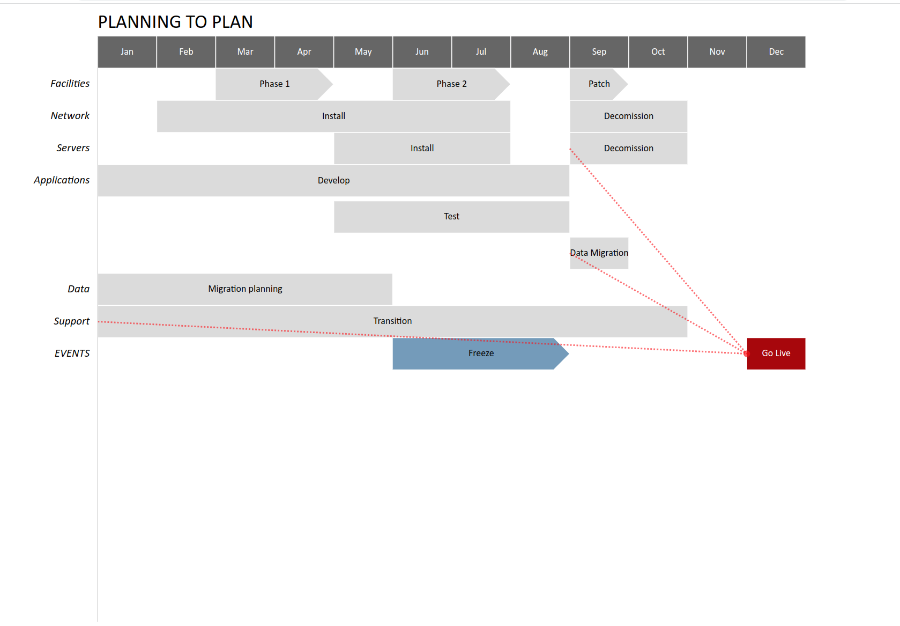

# Roadmap

roadmap reads a XML description and outputs an SVG rendition of a roadmap.

The XML description specifies a roadmap that contain categories, which in turn contain an arbitratry number of items.
Items may contains dependencies to other items.

```
<roadmap...>
    <category ...>
      <item ...>Item 1<dep dest="i3"/></item>
      <item ...>Item 2</item>
    </category>

    <category...>
      <item id="i3">Item 3</item>
    </category>
</roadmap>
```

## Roadmap attributes
* title -- title of the roadmap
* begin -- begining year of the roadmap
* end   -- ending year of the roadmap (for example to specfiy a span of 2023-2025, begin="2023", end="2026")
* scale -- the number of items per period, for example 12 for 12 months of the year
* catpercent -- the canvas percentage from the left where catagory labels are placed
* vspace -- the default amount of vertical space between items within a category
* itemheight -- the default height of an item
* fontname -- font used for the text
* shape -- default shape of an item: 'r': rectangle (default), 'rr': rounded rectangle, 'c': circle, 'e': ellipse, 'a': arrow, 'l': line

## Category attributes
* name -- the name of the category
* color -- the category color
* vspace -- vertical space between items
* itemheight -- the height of items
* shape -- shape of items in this category
* bline -- if "on" draw a boundary line on top of the category
* catdesc -- category description

## Item attributes
* id -- item unique id used to connect items
* begin -- beginning of the item in them ```year/number``` for example 2023/01 for January 2023
* duration -- duration of the item in scale units, for example if the scale is set to 12, duration of 6 is six months
* color -- item color, overriding the category color
* shape -- item shape, overriding the category shape
* align -- text alignment of the item (middle (default), end, start)
* vspace -- vertical space between items
* bline -- if set to "on" draw a boundary line
* dep -- dependencies between items
* desc -- item description

## Dependency attributes
* dest -- the item id to point to
* desc -- dependency description

For example, given:
```
<roadmap title="PLANNING TO PLAN" begin="2010" end="2011" scale="12" catpercent="12"
vspace="45" itemheight="40" fontname="Calibri" shape="r">
  <category name="" vspace="0" shape="r" color="#666666">
    <item begin="2010/01" duration="1" >Jan</item>
    <item begin="2010/02" duration="1" >Feb</item>
    <item begin="2010/03" duration="1" >Mar</item>
    <item begin="2010/04" duration="1" >Apr</item>
    <item begin="2010/05" duration="1" >May</item>
    <item begin="2010/06" duration="1" >Jun</item>
    <item begin="2010/07" duration="1" >Jul</item>
    <item begin="2010/08" duration="1" >Aug</item>
    <item begin="2010/09" duration="1" >Sep</item>
    <item begin="2010/10" duration="1" >Oct</item>
    <item begin="2010/11" duration="1" >Nov</item>
    <item begin="2010/12" duration="1" >Dec</item>
  </category>
  <category name="Facilities" shape="a">
    <item begin="2010/3" duration="2">Phase 1</item>
    <item begin="2010/6" duration="2">Phase 2</item>
    <item begin="2010/9" duration="1">Patch</item>
  </category>
  <category name="Network">
    <item begin="2010/2" duration="6">Install</item>
    <item begin="2010/9" duration="2">Decomission</item>
  </category>
  <category name="Servers">
    <item begin="2010/5" duration="3">Install</item>
    <item begin="2010/9" duration="2">Decomission<dep dest="gl"/></item>
  </category>
  <category name="Applications" vspace="45">
    <item begin="2010/1" duration="8">Develop</item>
    <item begin="2010/5" duration="4">Test</item>
    <item id="dm" begin="2010/9" duration="1">Data Migration<dep dest="gl"/></item>
  </category>
  <category name="Data" vspace="0">
    <item begin="2010/1" duration="5">Migration planning</item>
  </category>
  <category name="Support">
    <item begin="2010/1" duration="10">Transition<dep dest="gl"/></item>
  </category>
  <category name="EVENTS" shape="r">
    <item begin="2010/6" duration="3" color="#729BBC" shape="a">Freeze</item>
    <item id="gl" begin="2010/12" duration="1" color="#aa0000">Go Live</item>
  </category>
</roadmap>

```

where the above file is ```p2p.xml```, the command ```roadmap p2p.xml > p2p.svg``` Produces:




## Command line options
```
Usage of roadmap:
  -align string
    	label alignment (default "end")
  -b	bold categories
  -bb
    	bottom border
  -bg string
    	background color (default "white")
  -cb
    	category border
  -cc string
    	connection color (default "red")
  -cfs float
    	category font size (px) (default 14)
  -csv string
    	write CSV to specified file
  -curves string
    	curve line connections (default "0,0")
  -dc string
    	description color (default "red")
  -de
    	description at the end of the item (default true)
  -h float
    	height (default 768)
  -ifs float
    	item fontsize (px) (default 12)
  -lb
    	left border (default true)
  -margin float
    	margin (default 10)
  -rb
    	right border
  -tb
    	top border
  -tfs float
    	title font size (px) (default 24)
  -w float
    	width (default 1024)
  -wrap float
    	text wrap (default 20)
```
